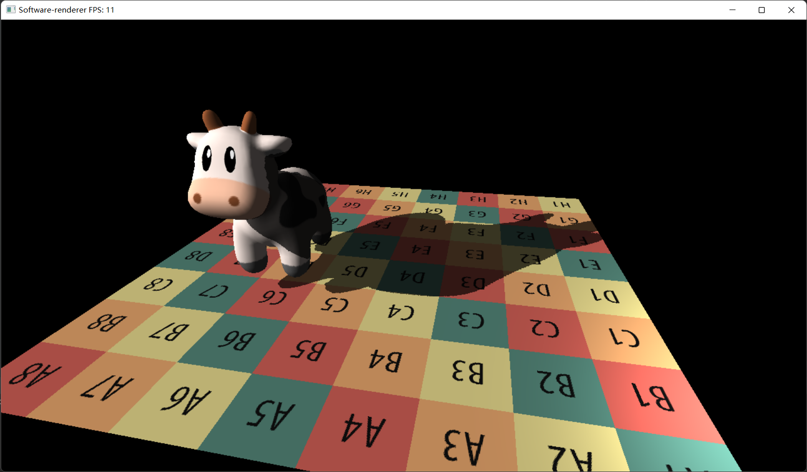

# software-renderer
阴影效果

# 操作说明
+ w/a/s/d 前左后右
+ x 上升
+ z 下降
+ 鼠标控制视角
+ ctrl+c 关闭程序

# Package manager
vcpkg

# Third-part
+ Eigen (math lib)
+ tiny_obj_loader (obj loader)
+ stb_image(image loader)

# Feature
+ Bresenham’s 直线算法
+ zBuffer Test
+ 视锥剔除
+ 齐次空间裁剪（注意判空）
+ 透视矫正
+ 背面剔除
+ Shadow Map

# TODO
+ shadow
+ 多线程fragment shader
+ 天空盒
+ package the matrix
+ turn the rotation to quaternion

# bug
+ 移动速度过快

# attention
+ 使用深度测试，不要使用NDC空间中的z进行深度测试。由于是NDC的z是非线性的变化得到的，会导致中间点的z坐标实质上向相机靠近，就出错了。不使用NDC坐标进行深度测试就没事。